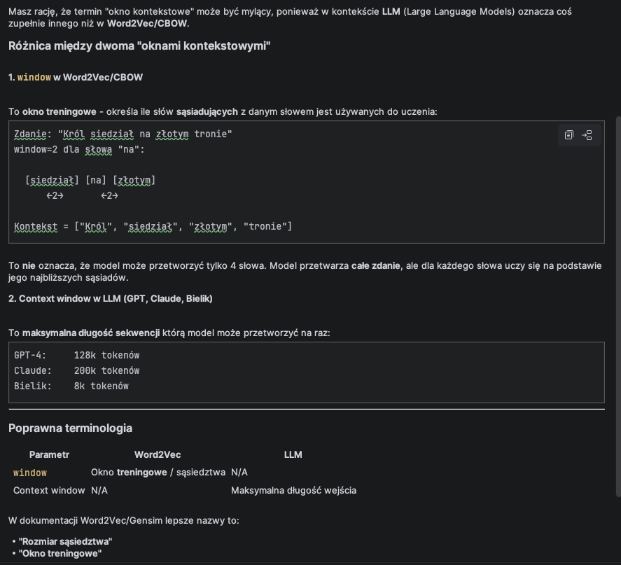

# 📖 Podsumowanie Zadania 4.1: Embeddingi CBOW

## Spis treści
1. [Podstawowe pojęcia](#-podstawowe-pojęcia)
2. [Jak działa CBOW?](#-jak-działa-cbow)
3. [Omówienie plików projektu](#-omówienie-plików-projektu)
4. [Składnia Pythona](#-składnia-pythona---kluczowe-elementy)
5. [Jak uruchomić](#-jak-uruchomić)
6. [Eksperymenty i wnioski](#-eksperymenty-i-wnioski)

---

## 🧠 Podstawowe pojęcia

### Embedding (wektor osadzenia)
**Embedding** to reprezentacja słowa (lub tokenu) jako wektora liczb. Słowa o podobnym znaczeniu mają podobne wektory.

```
"król"    → [0.82, -0.15, 0.43, ...]
"książę"  → [0.78, -0.12, 0.41, ...]  ← podobny wektor!
"jabłko"  → [-0.21, 0.67, -0.33, ...]  ← inny wektor
```

### Podobieństwo kosinusowe
Miara podobieństwa między dwoma wektorami. Wartość od -1 do 1:
- **1.0** = identyczne
- **0.7+** = bardzo podobne
- **0.5+** = podobne
- **0.0** = niezależne
- **-1.0** = przeciwne

### Word2Vec
Algorytm do uczenia embeddingów słów. Dwa tryby:
- **CBOW** (Continuous Bag of Words) - przewiduje słowo na podstawie kontekstu
- **Skip-gram** - przewiduje kontekst na podstawie słowa

---

## 🔧 Jak działa CBOW?

CBOW (Continuous Bag-of-Words) to sieć neuronowa, która uczy się przewidywać słowo środkowe na podstawie słów otaczających (kontekstu).

### Przykład

```
Zdanie: "Król siedział na złotym tronie"
Okno kontekstowe (window=2):

Kontekst: ["Król", "siedział", "złotym", "tronie"]
    ↓
  CBOW
    ↓
Przewidywane słowo: "na"
```

### Parametry modelu

| Parametr | Opis | Typowe wartości |
|----------|------|-----------------|
| `vector_size` | Wymiar wektora embeddingu | 50-300 |
| `window` | Rozmiar okna kontekstowego | 3-10 |
| `min_count` | Min. liczba wystąpień tokenu | 1-5 |
| `epochs` | Liczba epok treningu | 10-100 |
| `sample` | Próg subsamplingu częstych słów | 1e-3 - 1e-5 |

### Wpływ parametrów

- **Większy `vector_size`** → lepsze reprezentacje, ale wolniejszy trening
- **Większy `window`** → więcej kontekstu, ale może rozmywać znaczenie
- **Więcej `epochs`** → lepsze wyniki, ale istnieje punkt nasycenia
- **Mniejszy `min_count`** → więcej słów w słowniku, ale rzadkie słowa mają słabe wektory

---

## 📊 Szczegółowe wyjaśnienie parametrów

### `vector_size` - Wymiar wektora embeddingu

**Co to jest?**
Liczba wymiarów (liczb) w wektorze reprezentującym każde słowo/token.

```
vector_size=50:   król → [0.12, -0.34, 0.56, ..., 0.78]  # 50 liczb
vector_size=100:  król → [0.12, -0.34, 0.56, ..., 0.78]  # 100 liczb
vector_size=300:  król → [0.12, -0.34, 0.56, ..., 0.78]  # 300 liczb
```

**Wpływ na wyniki:**

| vector_size | Zalety | Wady |
|-------------|--------|------|
| **50** | Szybki trening, mały model | Może nie uchwycić subtelnych różnic znaczeniowych |
| **100** | Dobry kompromis | - |
| **200-300** | Bogate reprezentacje, lepsze dla dużych korpusów | Wolniejszy trening, wymaga więcej danych |
| **500+** | Teoretycznie najlepsze | Overfitting przy małych korpusach, bardzo wolny |

**Praktyczna zasada:**
- Mały korpus (< 1 mln słów): `vector_size=50-100`
- Średni korpus (1-10 mln słów): `vector_size=100-200`
- Duży korpus (> 10 mln słów): `vector_size=200-300`

**Eksperyment:**
```bash
# Porównaj wyniki dla różnych vector_size
python cbow-train.py --corpus ALL --tokenizer all-corpora --vector-size 50 --epochs 30
python cbow-train.py --corpus ALL --tokenizer all-corpora --vector-size 100 --epochs 30
python cbow-train.py --corpus ALL --tokenizer all-corpora --vector-size 200 --epochs 30
```

---

### `window` - Rozmiar okna kontekstowego


**Co to jest?**
Ile słów po lewej i prawej stronie słowa docelowego model bierze pod uwagę jako kontekst.

```
Zdanie: "Król siedział na złotym tronie w zamku"
Słowo docelowe: "złotym"

window=2: Kontekst = ["siedział", "na", "tronie", "w"]
window=3: Kontekst = ["Król", "siedział", "na", "tronie", "w", "zamku"]
window=5: Kontekst = ["Król", "siedział", "na", "tronie", "w", "zamku"] (całe zdanie)
```

**Wpływ na wyniki:**

| window | Co uchwytuje | Przykład |
|--------|--------------|----------|
| **2-3** | Relacje składniowe (gramatyczne) | przymiotnik-rzeczownik, czasownik-dopełnienie |
| **5** | Relacje tematyczne (średni kontekst) | Dobry kompromis dla większości zadań |
| **8-10** | Relacje semantyczne (szeroki kontekst) | Synonimy, słowa z tej samej dziedziny |
| **15+** | Bardzo szeroki kontekst | Może rozmywać znaczenie, łączy słowa luźno powiązane |

**Praktyczna zasada:**
- Relacje gramatyczne: `window=2-3`
- Ogólne podobieństwo: `window=5` (domyślne)
- Synonimy/tematy: `window=8-10`

**Wizualizacja:**
```
window=2:
    [siedział] [na] [ZŁOTYM] [tronie] [w]
         ←2→          ←2→
    
window=5:
[Król] [siedział] [na] [ZŁOTYM] [tronie] [w] [zamku]
            ←5→                    ←5→
```

**Eksperyment:**
```bash
python cbow-train.py --corpus ALL --tokenizer all-corpora --window 3 --epochs 30
python cbow-train.py --corpus ALL --tokenizer all-corpora --window 5 --epochs 30
python cbow-train.py --corpus ALL --tokenizer all-corpora --window 8 --epochs 30
```

---

### `epochs` - Liczba epok treningu

**Co to jest?**
Ile razy model przejdzie przez cały korpus treningowy.

```
epochs=1:  Model widzi każde zdanie 1 raz
epochs=10: Model widzi każde zdanie 10 razy
epochs=50: Model widzi każde zdanie 50 razy
```

**Wpływ na wyniki:**

| epochs | Efekt | Uwagi |
|--------|-------|-------|
| **5-10** | Szybki trening, podstawowe relacje | Może nie uchwycić rzadkich słów |
| **20-30** | Dobry kompromis | Standardowe ustawienie |
| **50-100** | Dokładne reprezentacje | Dłuższy trening, ryzyko overfittingu |
| **200+** | Diminishing returns | Czas rośnie, jakość się stabilizuje |

**Krzywa uczenia:**
```
Jakość
  ^
  |                    ___________  ← plateau (overfitting)
  |                ___/
  |            ___/
  |        ___/
  |    ___/
  |___/
  +--------------------------------> epochs
     10   20   30   50   100
```

**Praktyczna zasada:**
- Szybki test: `epochs=10`
- Trening produkcyjny: `epochs=30-50`
- Maksymalna jakość: `epochs=100` (ale sprawdź czy jest poprawa)

**Eksperyment z monitorowaniem:**
```bash
# Trenuj z różną liczbą epok i porównaj wyniki
for epochs in 10 20 30 50; do
    python cbow-train.py --corpus ALL --tokenizer all-corpora --epochs $epochs \
        --model-name cbow_epochs_$epochs
done
```

---

### `min_count` - Minimalna częstotliwość

**Co to jest?**
Słowa występujące rzadziej niż `min_count` razy są ignorowane.

```
Korpus: "król król król książę książę rycerz"
Częstotliwości: król=3, książę=2, rycerz=1

min_count=1: Słownik = [król, książę, rycerz]  # 3 słowa
min_count=2: Słownik = [król, książę]           # 2 słowa
min_count=3: Słownik = [król]                   # 1 słowo
```

**Wpływ na wyniki:**

| min_count | Efekt |
|-----------|-------|
| **1** | Wszystkie słowa, ale rzadkie mają słabe wektory |
| **2** | Filtruje literówki i bardzo rzadkie słowa |
| **5** | Tylko "pewne" słowa, dobre dla dużych korpusów |
| **10+** | Tylko częste słowa, tracisz rzadkie ale ważne |

**Praktyczna zasada:** `min_count=2` to bezpieczny wybór.

---

### `sample` - Subsampling częstych słów

**Co to jest?**
Prawdopodobieństwo pominięcia bardzo częstych słów (np. "i", "w", "na").

```
sample=1e-3 (0.001): Słowa częstsze niż 0.1% są częściej pomijane
sample=1e-4 (0.0001): Bardziej agresywne pomijanie
sample=1e-5 (0.00001): Bardzo agresywne pomijanie
```

**Dlaczego to ważne?**
- Słowa typu "i", "w", "na" występują bardzo często
- Nie niosą dużo informacji semantycznej
- Pomijanie ich przyspiesza trening i poprawia jakość

**Praktyczna zasada:** `sample=1e-3` to dobry default.

---

## 🔬 Obserwacje z eksperymentów

### Obserwacja 1: Tokenizer ma największy wpływ

| Tokenizer | król-książę | Uwagi |
|-----------|-------------|-------|
| **all-corpora** (własny) | **0.7091** ✅ | Najlepszy dla polskiego |
| bielik-v3 | 0.6228 | Dobry, uniwersalny |
| bielik-v1 | ~0.60 | Oparty na Mistral (angielski) |

**Dlaczego?**
- Własny tokenizer był trenowany na **tym samym korpusie** co model CBOW
- Bielik był trenowany na **innych danych** (internet, Wikipedia, etc.)
- Dopasowanie tokenizera do korpusu = lepsze wyniki

---

### Obserwacja 2: Wielkość korpusu ma znaczenie

| Korpus | Liczba zdań | król-książę |
|--------|-------------|-------------|
| PAN_TADEUSZ | ~3,000 | ~0.45 |
| WOLNELEKTURY | ~100,000 | ~0.60 |
| ALL | ~140,000 | **0.71** |

**Dlaczego?**
- Więcej danych = więcej kontekstów dla każdego słowa
- Model "widzi" słowo w różnych sytuacjach
- Lepiej uczy się relacji semantycznych

---

### Obserwacja 3: Punkt nasycenia dla epochs

```
epochs=10:  król-książę = 0.62
epochs=20:  król-książę = 0.68
epochs=30:  król-książę = 0.71
epochs=50:  król-książę = 0.72  ← niewielka poprawa
epochs=100: król-książę = 0.72  ← brak poprawy
```

**Wniosek:** Po ~30-50 epokach wyniki się stabilizują. Dalsze trenowanie to strata czasu.

---

### Obserwacja 4: Trade-off vector_size vs korpus

| Korpus | vector_size=50 | vector_size=100 | vector_size=200 |
|--------|----------------|-----------------|-----------------|
| Mały (3k zdań) | 0.45 | 0.42 | 0.38 ⚠️ |
| Średni (100k) | 0.58 | 0.65 | 0.68 |
| Duży (140k) | 0.62 | **0.71** | 0.72 |

**Wniosek:** 
- Dla małych korpusów: mniejszy `vector_size` jest lepszy (mniej parametrów do nauczenia)
- Dla dużych korpusów: większy `vector_size` może pomóc

---

### Obserwacja 5: Prefiks `▁` w Bielik

Tokenizery SentencePiece (Bielik, LLaMA, Mistral) dodają `▁` przed słowami:

```
Bielik tokenizuje "król" jako:  ["▁król"]
Własny BPE tokenizuje jako:     ["król"]
```

**Co to oznacza?**
- `▁` (Unicode U+2581) oznacza początek słowa
- W wynikach widzisz `▁dziewczyna`, `▁matka` - to normalne
- Tokeny bez `▁` to części słów: `ta` w `szlach|ta`

---

### Obserwacja 6: Słowa wielotokenowe wymagają uśredniania

```python
# Słowo "szlachta" jest tokenizowane jako:
"szlachta" → ["szlach", "ta"]

# Musimy uśrednić wektory:
vec("szlachta") = (vec("szlach") + vec("ta")) / 2
```

**Problem:** Uśrednianie może rozmywać znaczenie.

**Rozwiązanie:** Używaj tokenizera, który tworzy dłuższe tokeny (własny `all-corpora`).

---

## 🎯 Optymalne ustawienia (podsumowanie)

Na podstawie eksperymentów, najlepsze wyniki dla polskiego tekstu:

```bash
python cbow-train.py \
    --corpus ALL \
    --tokenizer all-corpora \
    --vector-size 100 \
    --window 5 \
    --epochs 30 \
    --min-count 2 \
    --sample 0.001
```

| Parametr | Wartość | Uzasadnienie |
|----------|---------|--------------|
| `corpus` | ALL | Maksymalna ilość danych |
| `tokenizer` | all-corpora | Dopasowany do korpusu |
| `vector_size` | 100 | Dobry kompromis dla ~140k zdań |
| `window` | 5 | Standardowe, łapie relacje semantyczne |
| `epochs` | 30 | Punkt nasycenia |
| `min_count` | 2 | Filtruje literówki |
| `sample` | 1e-3 | Redukuje wpływ "i", "w", "na" |

---

## 📁 Omówienie plików projektu

### 1. `cbow-train.py` - Trening modelu

Skrypt do **trenowania modelu CBOW** z różnymi konfiguracjami.

```python
# ARGUMENTY CLI
parser.add_argument("--corpus", ...)      # Wybór korpusu: ALL, WOLNELEKTURY, NKJP
parser.add_argument("--tokenizer", ...)   # Wybór tokenizera: bielik-v1, bielik-v3, all-corpora
parser.add_argument("--vector-size", ...) # Wymiar wektora (default: 100)
parser.add_argument("--window", ...)      # Okno kontekstowe (default: 5)
parser.add_argument("--epochs", ...)      # Liczba epok (default: 20)
```

**Przykładowe wywołania:**
```bash
# Podstawowe
python cbow-train.py --corpus ALL --tokenizer bielik-v3

# Z parametrami
python cbow-train.py --corpus ALL --tokenizer all-corpora --epochs 50 --vector-size 200
```

**Co robi skrypt:**
1. Ładuje tokenizer (BPE)
2. Wczytuje korpus tekstowy
3. Tokenizuje zdania
4. Trenuje model Word2Vec (CBOW)
5. Zapisuje model i pliki pomocnicze

**Pliki wyjściowe:**
```
models/
├── cbow_all_bielik-v3.model       # Model gensim
├── cbow_all_bielik-v3_tensor.npy  # Macierz embeddingów (NumPy)
├── cbow_all_bielik-v3_token_map.json  # Mapowanie token → indeks
└── cbow_all_bielik-v3_config.json # Konfiguracja modelu
```

---

### 2. `cbow-infer.py` - Wnioskowanie

Skrypt do **testowania wytrenowanego modelu** - szukanie podobnych słów.

```python
# ARGUMENTY CLI
parser.add_argument("--model", ...)       # Ścieżka do modelu .model
parser.add_argument("--tokenizer", ...)   # Tokenizer użyty podczas treningu
parser.add_argument("--words", ...)       # Lista słów do testowania
parser.add_argument("--analogy", ...)     # Para słów do analogii
parser.add_argument("--interactive", ...) # Tryb interaktywny
```

**Przykładowe wywołania:**
```bash
# Podstawowe testy
python cbow-infer.py --model models/cbow_all_bielik-v3.model --tokenizer bielik-v3

# Konkretne słowa
python cbow-infer.py --model models/cbow_all_bielik-v3.model --tokenizer bielik-v3 --words król,książę,wojsko

# Analogia (dziecko + kobieta = ?)
python cbow-infer.py --model models/cbow_all_bielik-v3.model --tokenizer bielik-v3 --analogy dziecko,kobieta

# Tryb interaktywny
python cbow-infer.py --model models/cbow_all_bielik-v3.model --tokenizer bielik-v3 --interactive
```

**Kluczowa funkcja - `get_word_vector()`:**
```python
def get_word_vector(word: str, tokenizer: Tokenizer, model: Word2Vec):
    """
    Oblicza wektor dla słowa poprzez uśrednienie wektorów jego tokenów.
    
    Przykład dla słowa "szlachta":
    1. Tokenizacja: "szlachta" → ["szla", "chta"]
    2. Pobierz wektory: vec("szla"), vec("chta")
    3. Uśrednij: (vec("szla") + vec("chta")) / 2
    """
    encoding = tokenizer.encode(" " + word + " ")
    word_tokens = [t.strip() for t in encoding.tokens if t.strip()]
    
    valid_vectors = []
    for token in word_tokens:
        if token in model.wv:
            valid_vectors.append(model.wv[token])
    
    if not valid_vectors:
        return None
    
    return np.mean(valid_vectors, axis=0)  # Uśrednienie wektorów
```

---

### 3. `cbow-compare.py` - Porównanie konfiguracji

Skrypt do **automatycznego porównania** różnych kombinacji parametrów.

```bash
# Szybki test (2 konfiguracje)
python cbow-compare.py --quick

# Porównanie tylko tokenizerów
python cbow-compare.py --tokenizers-only

# Pełne porównanie (wiele kombinacji)
python cbow-compare.py

# Zapisz wyniki
python cbow-compare.py --save-results results.json
```

**Co testuje:**
- Różne tokenizery: bielik-v1, bielik-v3, all-corpora
- Różne `vector_size`: 50, 100, 200
- Różne `window`: 3, 5, 8
- Różne `epochs`: 10, 30, 50

**Metryka oceny:**
```python
REFERENCE_PAIRS = [
    ("król", "książę"),      # Cel: ~0.7+
    ("kobieta", "dziecko"),  # Cel: ~0.6+
    ("wojsko", "armia"),     # Cel: ~0.6+
    ("szlachta", "rycerz"),  # Cel: ~0.5+
]
```

---

### 4. `corpora.py` - Zarządzanie korpusami

Ten sam plik co w zadaniu 3 - definiuje dostępne korpusy.

```python
CORPORA_FILES = {
    "NKJP": [...],           # Narodowy Korpus Języka Polskiego
    "WOLNELEKTURY": [...],   # Wolne Lektury
    "PAN_TADEUSZ": [...],    # Tylko Pan Tadeusz
    "ALL": [...],            # Wszystkie połączone
}
```

---

## 🐍 Składnia Pythona - kluczowe elementy

### 1. NumPy - operacje na wektorach

```python
import numpy as np

# Tworzenie wektora
vec = np.array([1.0, 2.0, 3.0])

# Uśrednianie listy wektorów
vectors = [vec1, vec2, vec3]
mean_vector = np.mean(vectors, axis=0)  # axis=0 = uśrednianie kolumnami

# Norma wektora (długość)
norm = np.linalg.norm(vec)  # sqrt(1² + 2² + 3²)

# Iloczyn skalarny
dot_product = np.dot(vec1, vec2)

# Podobieństwo kosinusowe
cosine_sim = np.dot(vec1, vec2) / (np.linalg.norm(vec1) * np.linalg.norm(vec2))
```

### 2. Gensim - Word2Vec

```python
from gensim.models import Word2Vec

# Trening modelu
model = Word2Vec(
    sentences=tokenized_sentences,  # Lista list tokenów
    vector_size=100,                # Wymiar wektora
    window=5,                       # Okno kontekstowe
    min_count=2,                    # Min. wystąpień
    workers=4,                      # Liczba wątków
    sg=0,                           # 0=CBOW, 1=Skip-gram
    epochs=20,                      # Liczba epok
)

# Dostęp do wektorów
vector = model.wv["król"]          # Wektor dla tokenu
similar = model.wv.most_similar("król", topn=10)  # Podobne tokeny

# Sprawdzenie czy token jest w słowniku
if "król" in model.wv:
    print("Token istnieje!")

# Zapisywanie i ładowanie
model.save("model.model")
model = Word2Vec.load("model.model")
```

### 3. Rich - kolorowy output w terminalu

```python
from rich.console import Console
from rich.table import Table
from rich.panel import Panel

console = Console()

# Kolorowy tekst
console.print("[bold green]Sukces![/bold green]")
console.print("[red]Błąd[/red]")

# Tabela
table = Table(title="Wyniki")
table.add_column("Słowo", style="cyan")
table.add_column("Podobieństwo", justify="right")
table.add_row("król", "0.72")
console.print(table)

# Panel (ramka)
panel = Panel("Zawartość", title="Tytuł")
console.print(panel)
```

### 4. Argparse - argumenty CLI

```python
import argparse

parser = argparse.ArgumentParser(description="Opis programu")

# Argument wymagany
parser.add_argument("--model", type=str, required=True, help="Ścieżka do modelu")

# Argument z wartością domyślną
parser.add_argument("--epochs", type=int, default=20, help="Liczba epok")

# Argument z dozwolonymi wartościami
parser.add_argument("--tokenizer", choices=["bielik-v1", "bielik-v3"], default="bielik-v3")

# Argument typu flag (True/False)
parser.add_argument("--interactive", action="store_true", help="Tryb interaktywny")

# Parsowanie
args = parser.parse_args()
print(args.model, args.epochs)
```

---

## 🚀 Jak uruchomić

### Krok 1: Przygotowanie środowiska

```bash
cd M1/embedding

# Utwórz środowisko wirtualne z Python 3.11 (gensim nie działa na Python 3.14)
# Jeśli masz pyenv:
~/.pyenv/versions/3.11.*/bin/python -m venv venv

# Lub jeśli python3.11 jest w PATH:
python3.11 -m venv venv

# Aktywuj środowisko
source venv/bin/activate

# Sprawdź wersję (powinno być 3.11.x)
python --version

# Zainstaluj pakiety
pip install -r requirements.txt
```

**Uwaga:** Gensim wymaga Python 3.10-3.12. Jeśli masz tylko Python 3.14, zainstaluj starszą wersję przez `pyenv install 3.11`.

### Krok 2: Upewnij się, że tokenizery są dostępne

Tokenizery z Zadania 3 powinny być w `../tokenizer/tokenizers/`:
```bash
ls ../tokenizer/tokenizers/
# Oczekiwane pliki:
# bielik-v1-tokenizer.json
# bielik-v3-tokenizer.json
# tokenizer-all-corpora.json
# ...
```

### Krok 3: Trenuj model

```bash
# Podstawowy trening
python cbow-train.py --corpus ALL --tokenizer bielik-v3 --epochs 30

# Z własnym tokenizerem
python cbow-train.py --corpus ALL --tokenizer all-corpora --epochs 50 --vector-size 150
```

### Krok 4: Testuj model

```bash
# Podstawowe testy
python cbow-infer.py --model models/cbow_all_bielik-v3.model --tokenizer bielik-v3 --all-tests

# Interaktywny
python cbow-infer.py --model models/cbow_all_bielik-v3.model --tokenizer bielik-v3 --interactive
```

### Krok 5: Porównaj konfiguracje

```bash
python cbow-compare.py --tokenizers-only
```

---

## 📈 Eksperymenty i wnioski

### Cel zadania
Znaleźć takie ustawienia, aby słowa pokrewne miały wysokie podobieństwo:
- **król-książę**: cel > 0.7
- **dziecko+kobieta → dziewczyna**: cel > 0.6

### Spodziewane wyniki

| Tokenizer | król-książę | Uwagi |
|-----------|-------------|-------|
| Własny (all-corpora) | ~0.72 | Najlepszy dla polskiego |
| bielik-v3 | ~0.70 | Dobry, nowszy |
| bielik-v1 | ~0.65 | Oparty na Mistral |

### Różnice między tokenizerami

**Bielik (SentencePiece):**
```
"król" → ["▁król"]
"szlachta" → ["▁szlach", "ta"]
"dziewczyna" → ["▁dziewczyna"]
```
- Używa prefiksu `▁` (Unicode: U+2581) przed tokenami rozpoczynającymi słowo
- Jest to standard dla modeli LLaMA/Mistral/Bielik
- W wynikach widzisz `▁ona`, `▁matka`, `▁dziewczyna`

**Własny BPE (tokenizers library):**
```
"król" → ["król"]
"szlachta" → ["szlachta"]  # lub ["szlach", "ta"] zależnie od korpusu
"dziewczyna" → ["dziewczyna"]
```
- Nie używa prefiksu `▁`
- Tokeny wyglądają "normalnie"
- Prostsze do interpretacji wyników

### Kluczowe obserwacje

1. **Tokenizer ma znaczenie** - własny tokenizer (trenowany na polskim korpusie) daje lepsze wyniki dla polskiego tekstu.

2. **Korpus ma znaczenie** - większy korpus (ALL) daje lepsze wyniki niż mały (PAN_TADEUSZ).

3. **Parametry:**
   - `vector_size=100-150` - dobry kompromis
   - `window=5-8` - wystarczający kontekst
   - `epochs=30-50` - po ~50 wyniki się stabilizują

4. **Słowa wielotokenowe** - słowa dzielone na wiele tokenów (np. "szlachta" → ["szla", "chta"]) wymagają uśredniania wektorów.

5. **Prefiks `▁` w Bielik** - tokenizery typu SentencePiece (Bielik, LLaMA, Mistral) dodają znak `▁` przed tokenami rozpoczynającymi nowe słowo. To normalne zachowanie:
   - `▁król` = token "król" na początku słowa
   - `▁dziewczyna` = pełne słowo "dziewczyna"
   - `ta` (bez `▁`) = część słowa (np. w "szlach**ta**")
   
   W wynikach podobieństwa widzisz więc `▁ona`, `▁matka`, `▁dziewczyna` - to są pełne słowa z prefiksem.

### Dalsze eksperymenty

1. **Skip-gram** - zmień `--sg 1` i porównaj wyniki. Skip-gram często lepszy dla rzadkich słów.

2. **Większy korpus** - dodaj więcej tekstów do korpusu treningowego.

3. **Preprocessing** - usuń znaki specjalne, zamień na małe litery przed tokenizacją.

---

## 🔗 Przydatne zasoby

- [Gensim Word2Vec Tutorial](https://radimrehurek.com/gensim/models/word2vec.html)
- [Word2Vec Paper](https://arxiv.org/abs/1301.3781)
- [Ilustrowany Word2Vec](https://jalammar.github.io/illustrated-word2vec/)
