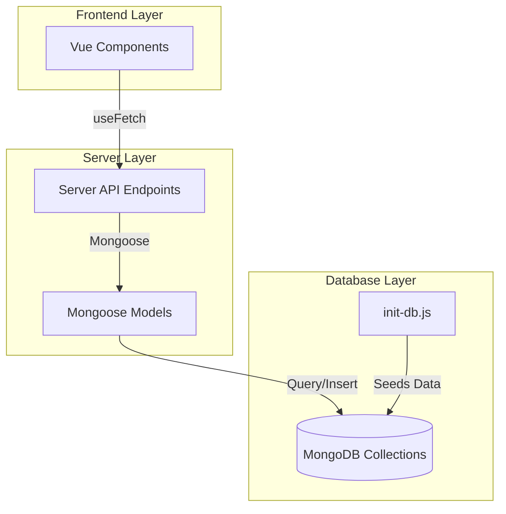

# Service Requests MongoDB Migration Plan

## Overview

Replace mock data with MongoDB for Transportation and Warehousing requests in the Service Requests section. This will follow the same pattern as the Dashboard implementation, using Mongoose models and Nuxt server API endpoints.

## Architecture



## Implementation Steps

### 1. Create MongoDB Collections and Seed Data

**File:** [`mongodb/cp/init-db.js`](mongodb/cp/init-db.js)

Add two new collections:

- `transportation_requests` - for transportation request documents
- `warehousing_requests` - for warehousing request documents

Seed with sample data from existing mocks in:

- [`cp-frontend/features/transportation/transportation-requests-listing/transportation-request.mocks.ts`](cp-frontend/features/transportation/transportation-requests-listing/transportation-request.mocks.ts)
- [`cp-frontend/features/warehousing/warehousing-request-details/warehousing-request-details.mocks.ts`](cp-frontend/features/warehousing/warehousing-request-details/warehousing-request-details.mocks.ts)

Create indexes for efficient querying:

- `requestNumber` (unique)
- `status`
- `createdAt` (descending)
- `priority`

### 2. Create Server API Directory Structure

Create new directory: `cp-frontend/server/api/service-requests/`

This will mirror the Dashboard pattern with models and endpoints co-located.

### 3. Create Mongoose Models

**New Files:**

- `cp-frontend/server/api/service-requests/TransportationRequest.model.ts`
- `cp-frontend/server/api/service-requests/WarehousingRequest.model.ts`

Use the full model definitions from:

- [`cp-frontend/features/transportation/transportation-requests-listing/transportation-request.model.ts`](cp-frontend/features/transportation/transportation-requests-listing/transportation-request.model.ts)
- [`cp-frontend/features/warehousing/warehousing-request-details/warehousing-request-details.model.ts`](cp-frontend/features/warehousing/warehousing-request-details/warehousing-request-details.model.ts)

Export both the interface (for TypeScript) and the Mongoose model:

```typescript
export interface ITransportationRequest {
  // Full model definition
}

export const TransportationRequest: mongoose.Model<ITransportationRequest> = 
  mongoose.models.TransportationRequest || 
  mongoose.model<ITransportationRequest>('TransportationRequest', schema, 'transportation_requests');
```

### 4. Create Server API Endpoints

**Transportation Endpoints:**

- `cp-frontend/server/api/service-requests/transportation.get.ts` - List all with optional filters
- `cp-frontend/server/api/service-requests/transportation/[id].get.ts` - Get single request by ID
- `cp-frontend/server/api/service-requests/transportation.post.ts` - Create new request

**Warehousing Endpoints:**

- `cp-frontend/server/api/service-requests/warehousing.get.ts` - List all with optional filters
- `cp-frontend/server/api/service-requests/warehousing/[id].get.ts` - Get single request by ID
- `cp-frontend/server/api/service-requests/warehousing.post.ts` - Create new request

Follow the pattern from [`cp-frontend/server/api/dashboard/metrics.get.ts`](cp-frontend/server/api/dashboard/metrics.get.ts):

- Use `defineEventHandler`
- Import models from co-located `.model.ts` files
- Use `createScopedLogger` for logging
- Apply `.lean()` for query optimization
- Handle errors with `createError`
- Support query parameters for filtering (status, priority, dateFrom, etc.)

### 5. Update Frontend - Transportation Listing

**File:** [`cp-frontend/features/transportation/transportation-requests-listing/transportation-requests-api.ts`](cp-frontend/features/transportation/transportation-requests-listing/transportation-requests-api.ts)

Replace mock-based implementation with $fetch calls:

```typescript
export async function getTransportationRequests(filters: PartialTransportationRequestFilters = {}): Promise<TransportationRequest[]> {
  const query = new URLSearchParams()
  if (filters.status) query.append('status', filters.status)
  if (filters.serviceType) query.append('serviceType', filters.serviceType)
  if (filters.dateFrom) query.append('dateFrom', filters.dateFrom)
  
  return await $fetch(`/api/service-requests/transportation?${query.toString()}`)
}
```

Keep the `useTransportationRequestsQuery` composable but update it to use the new API function.

### 6. Update Frontend - Transportation Details

**File:** [`cp-frontend/features/transportation/transportation-request-details/transportation-request-details-api.ts`](cp-frontend/features/transportation/transportation-request-details/transportation-request-details-api.ts)

Replace mock-based implementation:

```typescript
export async function getTransportationRequestDetails(id: string): Promise<TransportationRequest> {
  return await $fetch(`/api/service-requests/transportation/${id}`)
}
```

### 7. Update Frontend - Transportation Submit Form

**File:** [`cp-frontend/features/transportation/submit-transportation-request/submit-transportation-request-api.ts`](cp-frontend/features/transportation/submit-transportation-request/submit-transportation-request-api.ts)

Replace mock mutation with POST request:

```typescript
export async function submitTransportationRequest(data: SubmitTransportationRequestForm): Promise<SubmitTransportationRequestResponse> {
  return await $fetch('/api/service-requests/transportation', {
    method: 'POST',
    body: data
  })
}
```

### 8. Update Frontend - Warehousing Listing

**File:** [`cp-frontend/features/warehousing/warehousing-requests-listing/warehousing-requests-api.ts`](cp-frontend/features/warehousing/warehousing-requests-listing/warehousing-requests-api.ts)

Replace mock-based implementation with $fetch calls, similar to transportation listing.

### 9. Update Frontend - Warehousing Details

**File:** [`cp-frontend/features/warehousing/warehousing-request-details/warehousing-request-details-api.ts`](cp-frontend/features/warehousing/warehousing-request-details/warehousing-request-details-api.ts)

Replace mock-based implementation with ID-based fetch from server.

### 10. Update Frontend - Warehousing Submit Form

**File:** [`cp-frontend/features/warehousing/submit-warehousing-request/submit-warehousing-request-api.ts`](cp-frontend/features/warehousing/submit-warehousing-request/submit-warehousing-request-api.ts)

Replace mock mutation with POST request to server endpoint.

### 11. Clean Up Mock Files (Optional)

After verification, consider:

- Removing or archiving mock data files
- Removing mock imports from API files
- Updating any development mode flags

## Key Technical Decisions

1. **Date Handling:** MongoDB stores dates as ISODate, but Nuxt serializes them as strings. Parse dates on the frontend where needed.

2. **Filtering:** Implement server-side filtering in GET endpoints using Mongoose query methods (`.find({ status: ... })`).

3. **Error Handling:** Use structured error responses with appropriate HTTP status codes (404 for not found, 400 for validation errors, 500 for server errors).

4. **Logging:** Use scoped logger for each endpoint (`API:service-requests:transportation`, `API:service-requests:warehousing`).

5. **Model Co-location:** Keep models in the same directory as API endpoints (`server/api/service-requests/`) following the Dashboard pattern.

6. **Type Safety:** Export interfaces from models to maintain type safety across frontend and backend.

## Testing Checklist

After implementation:

- [ ] List transportation requests displays data from MongoDB
- [ ] Filter transportation requests by status, service type, date
- [ ] View transportation request details page
- [ ] Submit new transportation request (POST creates MongoDB document)
- [ ] List warehousing requests displays data from MongoDB
- [ ] Filter warehousing requests by status, storage type, priority
- [ ] View warehousing request details page
- [ ] Submit new warehousing request (POST creates MongoDB document)
- [ ] Verify data persists across server restarts
- [ ] Check error handling for invalid IDs and missing data

## Files to Create

- `mongodb/cp/init-db.js` (update existing)
- `cp-frontend/server/api/service-requests/TransportationRequest.model.ts`
- `cp-frontend/server/api/service-requests/WarehousingRequest.model.ts`
- `cp-frontend/server/api/service-requests/transportation.get.ts`
- `cp-frontend/server/api/service-requests/transportation.post.ts`
- `cp-frontend/server/api/service-requests/transportation/[id].get.ts`
- `cp-frontend/server/api/service-requests/warehousing.get.ts`
- `cp-frontend/server/api/service-requests/warehousing.post.ts`
- `cp-frontend/server/api/service-requests/warehousing/[id].get.ts`

## Files to Update

- `cp-frontend/features/transportation/transportation-requests-listing/transportation-requests-api.ts`
- `cp-frontend/features/transportation/transportation-request-details/transportation-request-details-api.ts`
- `cp-frontend/features/transportation/submit-transportation-request/submit-transportation-request-api.ts`
- `cp-frontend/features/warehousing/warehousing-requests-listing/warehousing-requests-api.ts`
- `cp-frontend/features/warehousing/warehousing-request-details/warehousing-request-details-api.ts`
- `cp-frontend/features/warehousing/submit-warehousing-request/submit-warehousing-request-api.ts`
